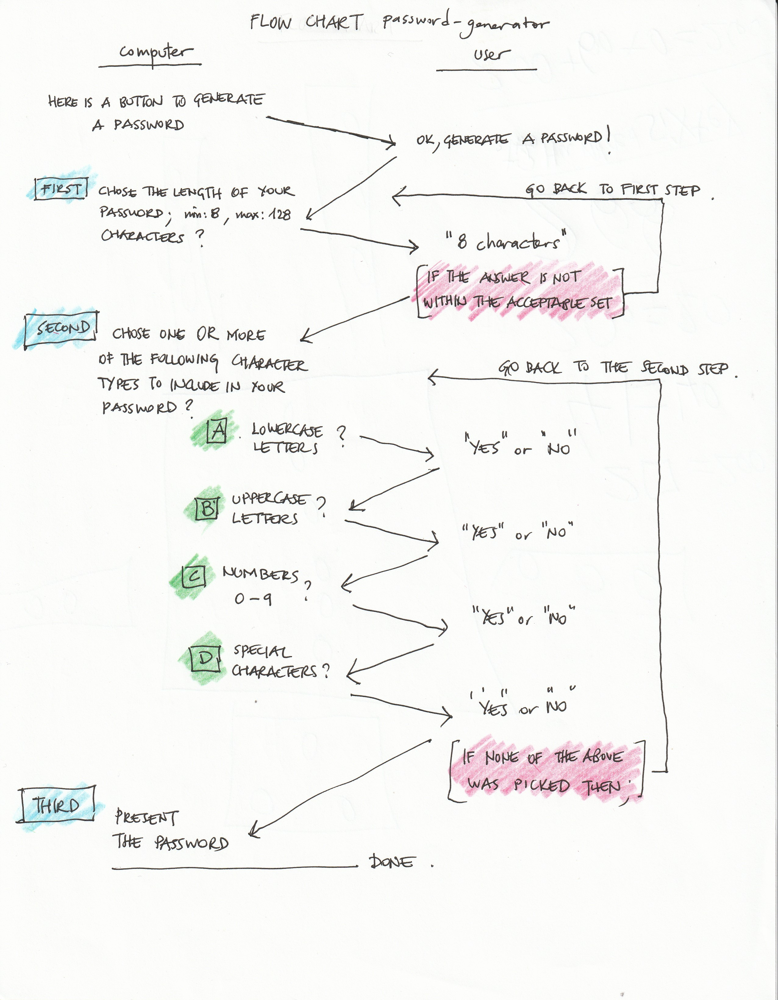
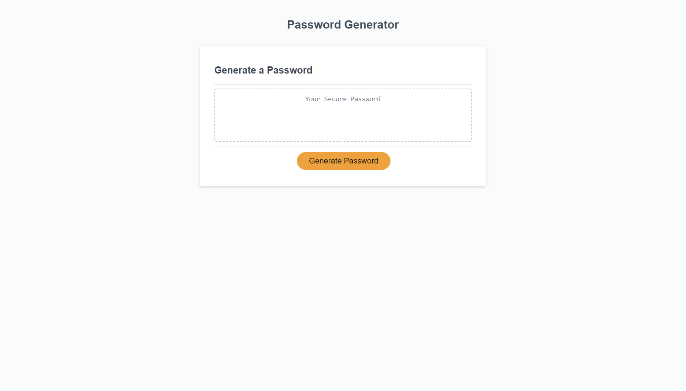
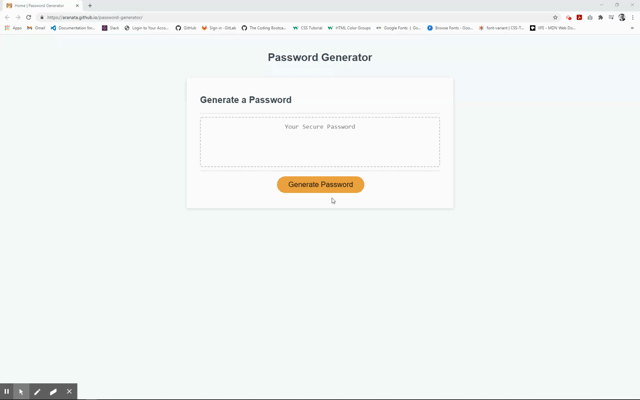

 

## **password generator** 
 

[https://aranata.github.io/password-generator/](https://aranata.github.io/password-generator/) 
 
 

## description

***

This is an assignment to modify a starter code and create a password generator in Java Script. The UI enables employees to 
generate random passwords based on criteria that they’ve selected. This app features dynamically updated HTML and CSS 
powered by JavaScript code that adapts to multiple screen sizes. 
This work was completed by using HTML, CSS and JS coding. Best viewed at full screen, 16:10 aspect ratio. 
 

## acceptance criteria

***

The codebase achieves the following criteria: 

* GIVEN I need a new, secure password: 
* WHEN I click the button to generate a password; THEN I am presented with a series of prompts for password criteria 
* WHEN prompted for password criteria; THEN I select which criteria to include in the password 
* WHEN prompted for the length of the password; THEN I choose a length of at least 8 characters and no more than 
128 characters
* WHEN prompted for character types to include in the password; THEN I choose lowercase, uppercase, numeric, and/or special characters
* WHEN I answer each prompt; THEN my input should be validated and at least one character type should be selected
* WHEN all prompts are answered; THEN a password is generated that matches the selected criteria
* WHEN the password is generated; THEN the password is either displayed in an alert or written to the page
 
 

## usage

***

The flow chart: 
 

 
 

A full view screenshot that shows the whole webpage: 
 

 
 

A short video that shows how the UI works. 
 

 
 

## some valuable references

***

These notes and links are listing some valuable references among others that I used doing this project: 
 

[https://stackoverflow.com/questions/9719570/generate-random-password-string-with-requirements-in-javascript](https://stackoverflow.com/questions/9719570/generate-random-password-string-with-requirements-in-javascript)

A warning from Steve Sokolowski from a posting at the link above: 
* Any password generated with Math.random() is EXTREMELY BAD.
This function uses the system time as a seed for the 
random number generator. Anyone who knows the time the password was generated can easily brute-force the 
password. In almost all cases, this data is easily available - just take the registration_time column in a hacked database, 
and test out all the values generated by the Math.random() algorithm using the times from 15 to 0 minutes before. 
A password generated with Math.random() is completely worthless because the time the password was first used is 
enough for cracking it.

[https://developer.mozilla.org/](https://developer.mozilla.org/)

[https://favicon.io/favicon-generator/](https://favicon.io/favicon-generator/)

[https://shields.io/category/dependencies/](https://shields.io/category/dependencies/)

[https://www.screencastify.com/](https://www.screencastify.com/)

 
 

## credits

***

Stephen Woosley - Bootcamp Instructor 
Patrick Haberern - Bootcamp TA 
Tim Nagorski - Bootcamp TA 
Sean Walmer - Bootcamp TA 
 
 

## license

***

This is an assigment done under a bootcamp program, it is public but please contact the publisher before you use or 
change any content. 
ghibli.github@gmail.com
 
 

## badges

***

 
 

---
